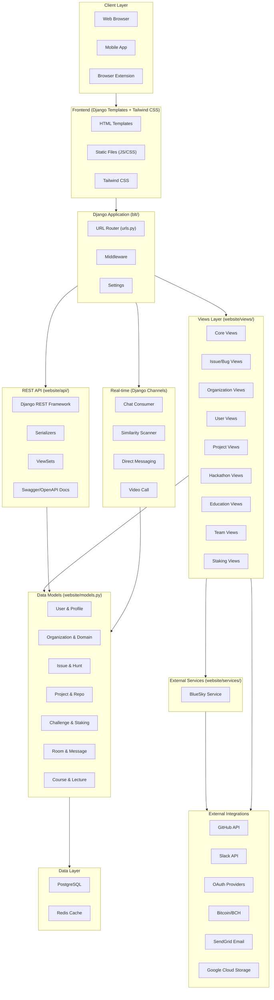
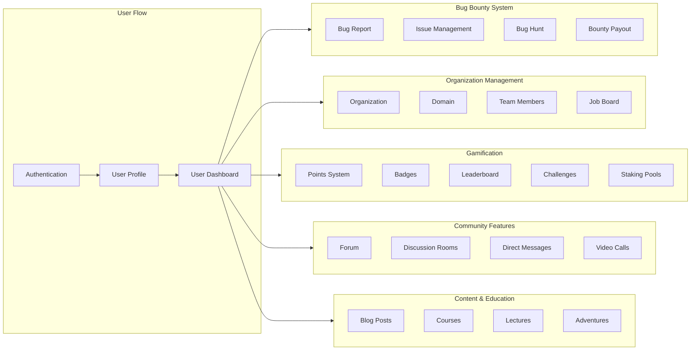
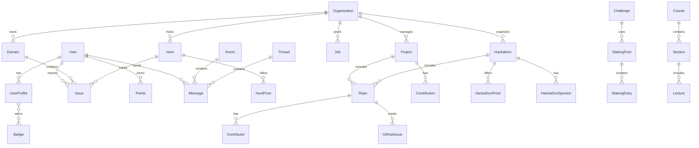
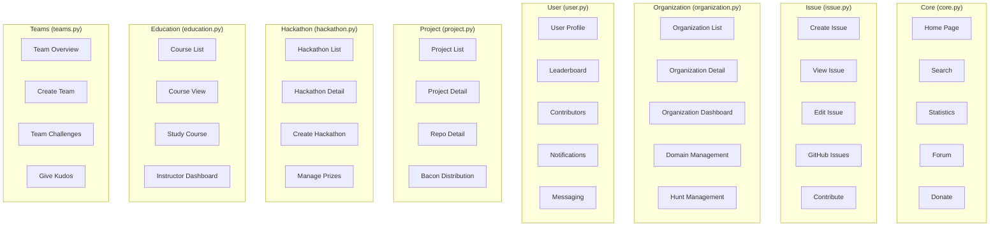
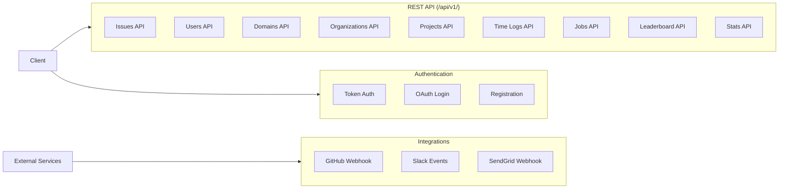
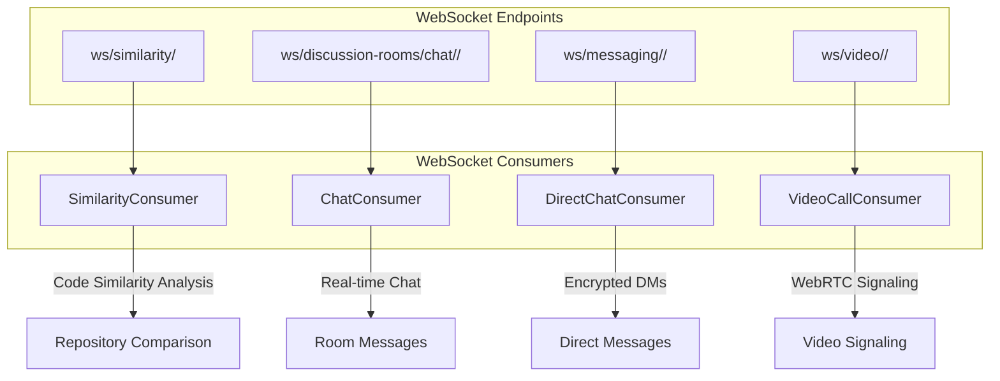
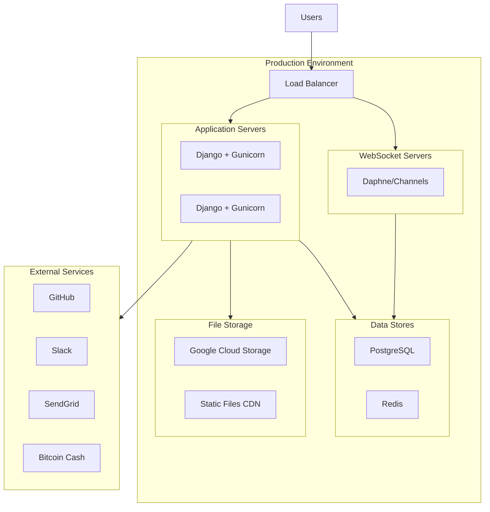

# OWASP BLT Architecture Diagram

This document provides a visual overview of the OWASP BLT (Bug Logging Tool) architecture.

## System Overview

## Component Details

### Core Components Architecture

## Data Model Relationships

## Views Structure

## API Endpoints Structure

## WebSocket Connections

## Deployment Architecture

## Technology Stack

| Layer | Technology |
|-------|------------|
| **Backend Framework** | Django 5.1+ |
| **Frontend** | Django Templates, Tailwind CSS, JavaScript |
| **Database** | PostgreSQL |
| **Cache** | Redis |
| **Real-time** | Django Channels (WebSocket) |
| **API** | Django REST Framework |
| **Authentication** | Django AllAuth, OAuth2 |
| **Task Queue** | Celery (optional) |
| **File Storage** | Google Cloud Storage |
| **Email** | SendGrid |
| **Version Control Integration** | GitHub API |
| **Communication** | Slack API |
| **Payments** | Bitcoin/BCH |
| **Containerization** | Docker |
| **Package Management** | Poetry |

## Feature Modules

| Module | Description |
|--------|-------------|
| **Bug Reporting** | Core issue/bug submission and tracking |
| **Bug Bounties** | Hunt creation, bounty management, rewards |
| **Organizations** | Company/org management, domains, team members |
| **Projects** | Open source project tracking, repos |
| **Hackathons** | Hackathon events, prizes, leaderboards |
| **Education** | Courses, lectures, learning paths |
| **Gamification** | Points, badges, challenges, staking |
| **Community** | Forum, chat rooms, direct messaging |
| **OSSH** | Open Source Sorting Hat - project recommendations |
| **Sizzle** | Time tracking and activity logging |
